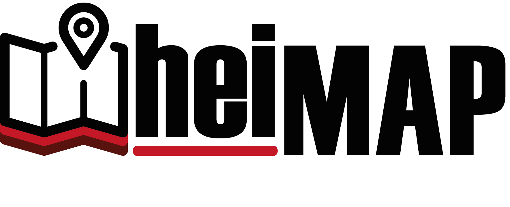

# heiMAP – A Virtual Research Environment

is a virtual environment for collaborative spatio-temporal research in the Humanities. The differentiating characteristic of heiMAP is its holistic approach, representing the entire scientific data lifecycle. This includes the generation of, as well as discourse about, spatio-temporal data, their publication, archiving and sustainable reuse. The VRE consists of an Open Source Content Management System (CMS) that handles data and research projects, and an integrated WebGIS application used to contextualize vector and raster data, especially maps. By sticking to international standards (OGC, CIDOC CRM among others), we strive for a maximum of data interoperability and reusability of the data produced within heiMAP. Close cooperation with the Heidelberg University Library and Heidelberg Computing Center allows for the publication, referenced by a Digital Object Identifier (DOI), as well as the long-term archiving of individual research projects and their related outcomes.

One major challenge in building an environment for collaborative research is to ensure that users retain control over their data where necessary but are also enabled to share it with others when they wish to. Therefore, heiMAP possesses a sophisticated system for user and rights management as well as fine-grained control of user rights based on the CMS. To allow a broad range of users from different parts of the Humanities (including both University and Citizen Science projects) with varying degrees of expertise in spatial research and GIS, to effectively use heiMAP, the platform focuses on a number of core functions while allowing export of research data into more sophisticated desktop-based GIS programs when necessary. Extensive tutorials and documentation further support users.

This repository contains source modules of the Application  

* Drupal src - Backend code using Drupal. Please refer to [Readme](src/drupal/README.md) for more details 
* Angularjs src - Frontend code using AngularJS framework. Please refer to [Readme](src/angularjs/README.md) for more details  

  

  
Further information can be found on the [project webpage](https://heimap.uni-heidelberg.de).
heiMAP was funded by the Ministry of Science, Research and the Arts of Baden-Württemberg.
